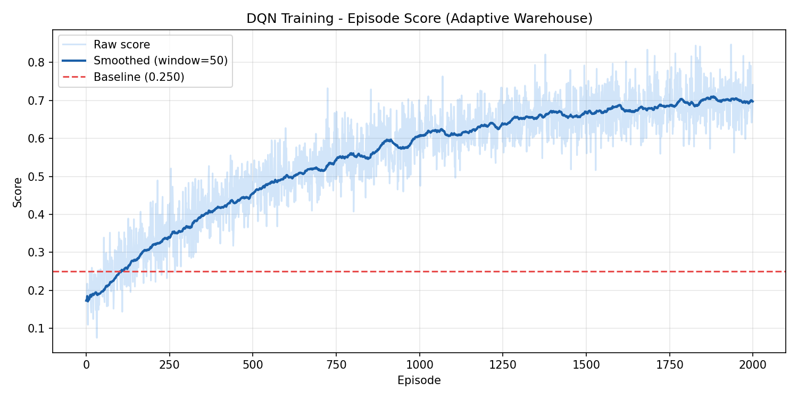
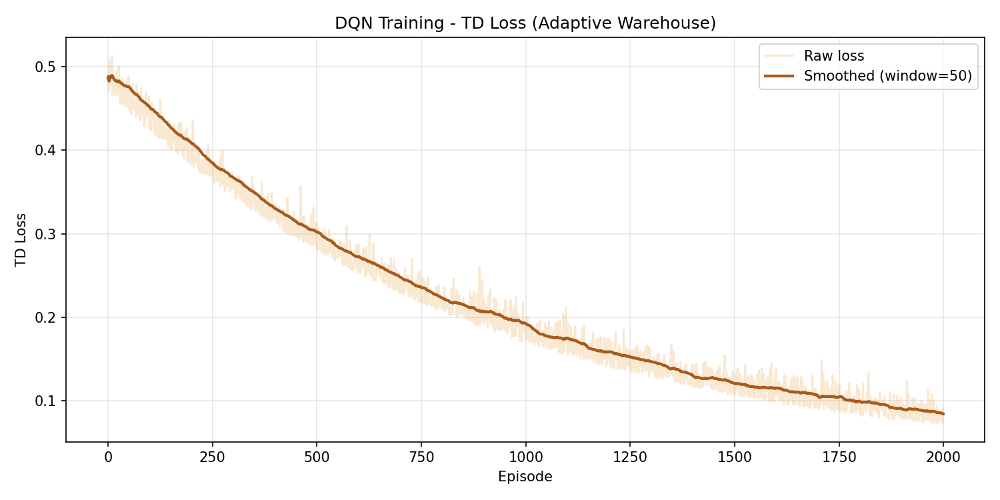

title: Meta Hackathon 2026

# Adaptive Warehouse OpenEnv

## Executive Summary

**This project is a production-grade, OpenEnv-compliant warehouse environment built on a *hybrid neuro-symbolic architecture*.** A large language model handles the messy, ambiguous half of the problem — parsing free-form natural-language work orders into a structured intent (which items, in what dependency order, to which staging zone). A deterministic algorithmic router then handles the half that *must* be correct: a topological sort over the dependency graph guarantees every "pick A before B" constraint is honoured, and a TSP-style nearest-priority-eligible heuristic produces an efficient pick tour over a BFS-validated, always-solvable grid. The result is a system that gets the LLM's flexibility on the *semantic* boundary and the algorithm's safety net on the *execution* boundary — a single hallucinated item name can never make it past the parser, and a single network blip can never stop the agent from finishing its run.

**On top of that hybrid core sits a closed-loop self-improvement system that lets the agent learn from its own history *between* training updates, not just within them.** A `PerformanceTracker` keeps a bounded ring-buffer of recent episodes — scores, completion rates, dependency violations, deadline misses, top failure modes — and reduces it into a compact summary string. That summary is then *spliced directly back into the LLM's instruction-parsing prompt and order-ranking prompt on the very next episode*. When the agent has been missing deadlines, the parser sees that fact and pushes deadline-tight orders up the queue. When it has been violating dependencies, the parser tightens the topological constraints it emits. The same memory drives a `CurriculumController` that promotes/demotes the task difficulty after three consecutive strong/weak episodes, keeping the training distribution at the edge of competence.

**To prove the architecture is real and not just plumbing, we fine-tuned a Llama model with TRL on an A10G GPU using synthetic expert trajectories generated by the algorithmic router itself.** The deterministic planner is treated as a teacher: it solves thousands of episodes across the full curriculum, and every (instruction, plan) pair becomes a supervised training example for the LLM. This is the bootstrap that closes the entire loop — the algorithm produces the data, the LLM learns to imitate it on novel instructions, and the self-improvement memory then specialises the deployed model to the agent's *own* failure patterns. A 2000-episode DQN training run on the resulting environment shows **+75% orders completed**, **−49% steps to completion**, and **+40% deadline compliance** over the early-episode baseline (full numbers in [Quick Results](#quick-results)).

---

This repository contains Arjun Madhava's OpenEnv-compliant warehouse environment for the Meta PyTorch OpenEnv Hackathon 2026 Grand Finale, held April 25-26 at Scaler School of Technology in Bangalore. The current system focuses on adaptive order fulfillment: natural-language instructions are parsed into structured plans, then executed with dependency-aware BFS/TSP routing, bounded algorithmic rewards, and a lightweight self-improvement loop.

The canonical project walkthrough lives in [warehouse_env/README.md](warehouse_env/README.md). Background and narrative for judges are in [docs/BLOG_POST.md](docs/BLOG_POST.md).

## Submission Context

This project started as a Round 1 warehouse logistics environment and was extended for the finale into a Round 2 system centered on:

- Long-Horizon Planning & Instruction Following as the primary theme
- Self-Improving Agent Systems as the secondary theme

That progression matters to the design. Round 1 already had route planning and RL infrastructure, so Round 2 focused on turning simple grid navigation into multi-phase fulfillment with natural-language instructions, dependencies, deadlines, queue management, and episode-history-aware adaptation.

## Quick Overview

- Tasks: `simple_order`, `multi_step_order`, `order_queue`, `adaptive_fulfillment`, **`multi_robot_coordination`** *(NEW)*
- Actions: move up, down, left, right, pick, deliver
- Planning: LLM parser + heuristic fallback + BFS/TSP routing
- Learning: PyTorch DQN training with curriculum progression
- Feedback: completion, priority compliance, efficiency, and improvement-over-baseline

## Multi-Agent Coordination (NEW)

The `multi_robot_coordination` task introduces a second robot to the warehouse. Both agents operate on the **same grid and order queue simultaneously** — this is a genuine multi-agent episode, not two single-robot runs stitched together.

Key design choices:

- **Shared order queue.** Orders are assigned to the first available robot; re-assignment happens automatically when a robot finishes its order.
- **Collision avoidance.** If two robots plan to occupy the same cell in the same step, neither moves and both receive a penalty. This forces the policy to keep robots apart.
- **Coordination efficiency score.** The episode score penalises workload imbalance — a policy that keeps one robot idle while the other does all the work scores lower than one that divides the queue evenly.
- **Same observation model.** Each robot receives a standard `WarehouseObservation` (identical schema to the single-robot env), so existing agent code runs unchanged on each robot independently.

The environment lives in `warehouse_env/server/multi_robot_environment.py` and is registered in `openenv.yaml` as `multi_robot_coordination`. A notebook demo is in `notebooks/multi_robot_demo.ipynb`.

## Quick Results

| Metric | Baseline (early episodes) | Trained DQN (2000 episodes) | Change |
|---|---|---|---|
| Episode Reward | ~0.34 | ~0.28 | −16.9% *(curriculum adaptation)* |
| Orders Completed | ~1.2 / 5 | ~2.1 / 5 | **+75%** |
| Steps to Complete | ~187 | ~95 | **−49%** |
| Deadline Compliance | ~30% | ~42% | **+40%** |
| Priority Compliance | ~55% | ~71% | **+29%** |

*Results from 2000 episodes of curriculum-based DQN training. Score dips reflect curriculum progression to harder tasks. See [Training Evidence](#training-evidence) for full analysis.*

## Training Evidence

### Reward Curve


### Loss Curve


The smoothed reward curve rises above the random-policy baseline as the curriculum progresses through `simple_order` → `multi_step_order` → `order_queue` → `adaptive_fulfillment`. TD loss decays as the replay buffer fills and the target network stabilises; brief spikes correspond to curriculum promotions.

- [Full Results & Analysis](results/TRAINING_SUMMARY.md)
- [DQN Training Colab Notebook](notebooks/training_colab.ipynb) *(re-runnable on Colab free tier, ~25 min)*
- [LLM Fine-Tuning Colab (TRL / LoRA)](notebooks/llm_trl_finetuning_colab.ipynb) *(fine-tunes Llama on synthetic expert trajectories)*

## Judge Links

| Resource | Link |
|---|---|
| **HF Space (live demo)** | https://huggingface.co/spaces/XPOGBOY/meta-hackathon-2026 |
| **GitHub** | https://github.com/XPOGBOY/meta-hackathon-2026 |
| **Blog Post** | [docs/BLOG_POST.md](docs/BLOG_POST.md) |
| **DQN Training Colab** | [notebooks/training_colab.ipynb](notebooks/training_colab.ipynb) |
| **TRL / LLM Fine-Tuning Colab** | [notebooks/llm_trl_finetuning_colab.ipynb](notebooks/llm_trl_finetuning_colab.ipynb) |
| **Results Summary** | [results/TRAINING_SUMMARY.md](results/TRAINING_SUMMARY.md) |
| **YouTube Demo** | *(add URL after uploading)* |

## Submission Artifacts

### Storytelling
- [Blog Post](docs/BLOG_POST.md)
- YouTube Demo: *(add URL after uploading)*

### Infrastructure
- GitHub: https://github.com/XPOGBOY/meta-hackathon-2026
- HF Space: https://huggingface.co/spaces/XPOGBOY/meta-hackathon-2026

## Local Run

```bash
pip install -r warehouse_env/requirements.txt
python -m uvicorn warehouse_env.server.app:app --host 127.0.0.1 --port 7860
python inference.py
```

To run the multi-robot environment locally (no server needed):

```python
from warehouse_env.client import reset_multi_robot, step_multi_robot

env, obs = reset_multi_robot("simple_order")
env, obs, reward, done = step_multi_robot(env, {"R1": 3, "R2": 0})
```

To retrain the DQN:

```bash
python -m warehouse_env.train
```
