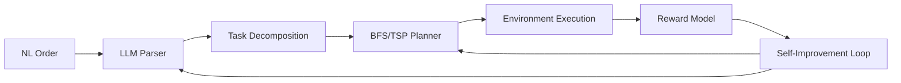

# Adaptive Warehouse Order Fulfillment

This project is Arjun Madhava's Round 2 OpenEnv environment for the Meta PyTorch OpenEnv Hackathon 2026 Grand Finale, held April 25-26 at Scaler School of Technology in Bangalore. The environment is built for the OpenEnv framework and is designed around the two themes that best matched the original warehouse project:

- Long-Horizon Planning & Instruction Following as the primary theme
- Self-Improving Agent Systems as the secondary theme

The hackathon is organized by Meta, PyTorch, Scaler, and Hugging Face. That context matters because this repo is not just a random warehouse simulator anymore; it is a deliberate extension of a working Round 1 OpenEnv submission into a more judge-facing Round 2 system with natural-language order fulfillment and an explicit self-improvement loop.

## Problem Statement

An AI warehouse agent operates in a grid-based fulfillment center and receives multi-step orders written in natural language. It must parse those instructions into structured sub-tasks, plan an efficient route that respects priorities, dependencies, fragile-item handling, and delivery deadlines, then improve its future decisions by learning from recent episode outcomes.

## Round 1 To Round 2

Round 1 was a cleaner warehouse routing problem: navigate the grid, avoid obstacles, and collect items efficiently. That version already had:

- OpenEnv-compatible environment/server wiring
- Docker plus Hugging Face Spaces deployment
- BFS shortest-path planning
- TSP-based pickup ordering
- A PyTorch DQN training path

For the finale, I kept that foundation and changed the actual challenge. The agent now has to understand instructions, sequence work across fulfillment phases, rank queued work, handle deadlines and stock issues, and adapt from recent failures instead of solving one static pickup puzzle.

I skipped Multi-Agent Interactions because rewriting the environment for multiple robots as a solo builder in four days felt too risky. I also chose not to make World Modeling the centerpiece, even though some of its ideas still show up conceptually through changing queues, deadlines, and dynamic episode conditions.

## Architecture



## What The System Does

- Receives complex warehouse orders as natural-language instructions.
- Uses an LLM through a LiteLLM or OpenAI-compatible proxy to parse instructions into structured plans, with a heuristic fallback when the proxy is unavailable.
- Plans routes with BFS shortest paths and a small TSP-style ordering pass, while also respecting dependency and priority constraints.
- Supports four task tiers that scale from a single simple order to dynamic multi-order fulfillment.
- Tracks episode memory, failure patterns, and average performance so later tasks can benefit from earlier runs.
- Includes a PyTorch DQN agent for curriculum-based RL training on the same environment.

## Task Tiers

| Task | Grid | Orders / Items | Key Features |
| --- | --- | --- | --- |
| `simple_order` | 5x5 | 1 order / 2 items | Intro task, no dependencies, short deadline, basic delivery flow |
| `multi_step_order` | 10x10 | 1 order / 4 items | Priorities, explicit dependency chain, fragile-item handling |
| `order_queue` | 10x10 | 3 sequential orders | Queue management, varying constraints, order ranking decisions |
| `adaptive_fulfillment` | 15x15 | 5 total orders | Dynamic arrivals, deadlines, stock shortages, more complex trade-offs |

## Key Features

- Natural-language order instructions that describe what to pick, in what spirit to prioritize it, and where to deliver it.
- Delivery zones at the warehouse edge instead of "pick everything and stop."
- Explicit item dependencies such as "pick foam insert before fragile sensor."
- Fragile items that are safer to pick after supporting items are already secured.
- Optional out-of-stock handling so the agent must recover gracefully rather than just fail hard.
- Dynamic order arrivals in the hardest tier, which forces re-planning under pressure.

## Reward Model

The reward model is fully algorithmic. I wanted the grading logic to stay inspectable and reproducible instead of drifting into prompt-judge territory.

- Picking an item gives `0.1 * priority`.
- Following dependency order gives `+0.15`; violating it gives `-0.2`.
- Delivering to the correct staging zone gives `+0.3`; the wrong zone gives `-0.3`.
- Completing an order gives `+0.5`.
- Finishing before the deadline adds a slack-based bonus.
- Picking a fragile item too early adds a small risk penalty.
- Every step costs `-0.001` to keep the planner honest.

The final episode score is bounded to `0.0001..0.9999` and combines:

- Completion ratio: 50%
- Priority compliance: 20%
- Efficiency: 15%
- Improvement over baseline: 15%

## Self-Improvement Loop

The project leans into the hackathon's self-improving-agent angle without pretending the agent is doing full autonomous research.

- Episode memory stores the latest runs with scores, steps, completion rate, and failure reasons.
- Performance tracking summarizes whether the agent is getting faster or simply making the same mistakes more consistently.
- Curriculum learning starts from `simple_order` and advances when performance stays above `0.8` for three episodes.
- A strategy adapter can feed recent history back into the LLM as a compact planning hint for the next run.

The result is not magic, but it is a practical loop: recent failures inform the next planning pass, and the environment exposes that history back through observations so the agent can see the consequences of earlier behavior.

## Local Development

Install dependencies:

```bash
pip install -r warehouse_env/requirements.txt
```

Start the server:

```bash
python -m uvicorn warehouse_env.server.app:app --host 127.0.0.1 --port 7860
```

Run inference:

```bash
python inference.py
```

Run training:

```bash
python -m warehouse_env.train
```

## LiteLLM / OpenAI Setup

The parser and strategy adapter will use the proxy automatically when these are available:

```bash
API_BASE_URL=https://your-litellm-proxy/v1
API_KEY=...
MODEL_NAME=gpt-4o-mini
```

`HF_TOKEN` also works in place of `API_KEY` if your Space is configured that way.

## Notes From Building It

Two design trade-offs shaped the project:

- I did not want the LLM deciding the reward, only the plan. That keeps the evaluation stable and lets the planner be improved independently.
- I kept the planner hybrid on purpose. A learned policy is useful, but in a deterministic grid world with explicit constraints, route search and dependency ordering still deliver a lot of value and are much easier to debug.

If you retrain the DQN after pulling changes, run:

```bash
python -m warehouse_env.train
```

The old checkpoint was removed because the observation size changed and it was no longer safe to load.
